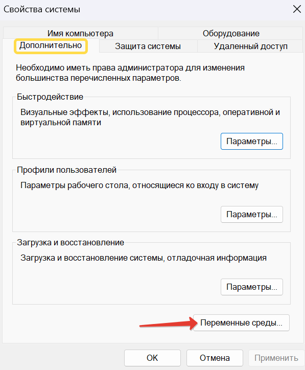

## Configuring Python for course development

### Providing `PYTHONPATH` on Windows

To set `PYTHONPATH` on a windows machine follow the below steps:
1. Open the Windows search bar and type `python.exe` (do not press Enter). 
Then right-click on the `python.exe` that appears in the menu and select **Open file location**.
   

2. Copy all path to `python.exe`.
   

3. Then right-click **This PC** and select **Properties**. Сlick on the **Advanced system settings** option. 
In the next window, select the **Advanced** tab and select **Environment Variables**.



4. In the **User Variables** menu, find a variable named **Path**. 
Then paste the path you copied earlier into the **Variable Value** option.

    1. If you cannot find variable **Path**, create one. To do this, click **New**. 
   Then in the variable name form type `PYTHONPATH` and paste your Python path into the variable value field.
   

   
   
5. Go back to the `python.exe` folder and open the **Scripts** folder. Copy its path.


6. Go back to **Environment variables**. Type a semicolon after the path to `python.exe` and 
paste the path to the **Scripts** folder. Click OK.


To see if Python is added to the Windows PATH, open a terminal and type `python --version`, then press Enter. 
If it returns the currently installed version of Python, then you have successfully added it to the Windows PATH.


### Setting up a `virtualenv`

Instructions for macOS users:

```
python3 -m pip install --user virtualenv
python3 -m virtualenv -p `which python3` venv
source venv/bin/activate
python -m pip install -r requirements.txt
```

Instructions for Windows users:

```
python -m venv venv
venv\Scripts\activate
python -m pip install -r requirements.txt
```
## Spell checking

1. Install dependencies 
   [spell checker](https://facelessuser.github.io/pyspelling/#usage-in-linux). 
   For example, for macOS:

   ```bash
   brew install aspell
   ```

1. Install Python dependencies:

   ```bash
   python -m pip install -r requirements_qa.txt
   ```

1. Run checks:

   ```bash
   python -m pyspelling -c config/spellcheck/.spellcheck.yaml
   ```

## Running tests

1. Install dependencies (assuming you have activated the environment from the previous step)
   ```bash
   python -m pip install -r requirements_qa.txt
   ```
   
1. Run the tests for the given mark. You can select any level: `mark4`, `mark6`, `mark8`, `mark10`:
   
   ```bash
   python -m pytest -m mark8
   ```

## CI stages

1. Stage 1. Style
   1. Stage 1.1. PR Name
   1. Stage 1.2. Code style (`pylint`, `flake8`)
   
1. Stage 2. Crawler
   1. Stage 2.1. Crawler config validation (we ensure that crawler has certain sanity checks)
   1. Stage 2.2. `Crawler` instantiation validation
   1. Stage 2.3. `Parser` instantiation validation
   1. Stage 2.4. Articles downloading
   1. Stage 2.5. Dataset volume validation
   1. Stage 2.6. Dataset structure validation
   
1. Stage 3. Text Processing Pipeline
   1. Stage 3.1. Dataset sanity checks (we ensure that pipeline has certain sanity checks)
   1. Stage 3.2. `CorpusManager` sanity checks (we ensure that pipeline identifies all articles correctly)
   1. Stage 3.3. `MorphologicalToken` sanity checks (we ensure that pipeline displays all tokens appropriately)
   1. Stage 3.4. Admin data processing
   1. Stage 3.5. Student dataset processing
   1. Stage 3.6. Student dataset validation
   
1. Stage 4. Additional tasks
   1. stage 4.1. `POSFrequencyPipeline` checks
   1. Stage 4.2. Frequency visualization
   

## Synchronizing between admin and public repository

1. Run the following command (macOS specific):
 
   ```bash
   cd ..
   diff -rq 2022-2-level-ctlr 2022-2-level-ctlr-admin/ \
          -x .git -x .idea -x .pytest_cache -x __pycache__ \
          -x venv -x tmp \
          -x dictionary.dic -x target_score.txt \
          -x scrapper_config.json -x scrapper.py \
          -x pipeline.py -x pos_frequency_pipeline.py \
          -x get_mark.sh -x requirements.txt \
          -x scrapper_config_test.json \
          -x .mypy_cache -x .coverage \
          -x htmlcov -x eliminate_old_workflows.py \
          -x test_tmp -x website_validation \
          -x build -x replace_scrapper_implementation.sh \
          -x dynamic_crawler.yml -x labs.txt -x labs_coverage_thresholds.json \
          -x crawler.yml -x venv_setup.sh \
          -x lab_5_scrapper -x lab_6_pipeline -x seminars -x README.md -x docs > hse.diff
   ```
   
