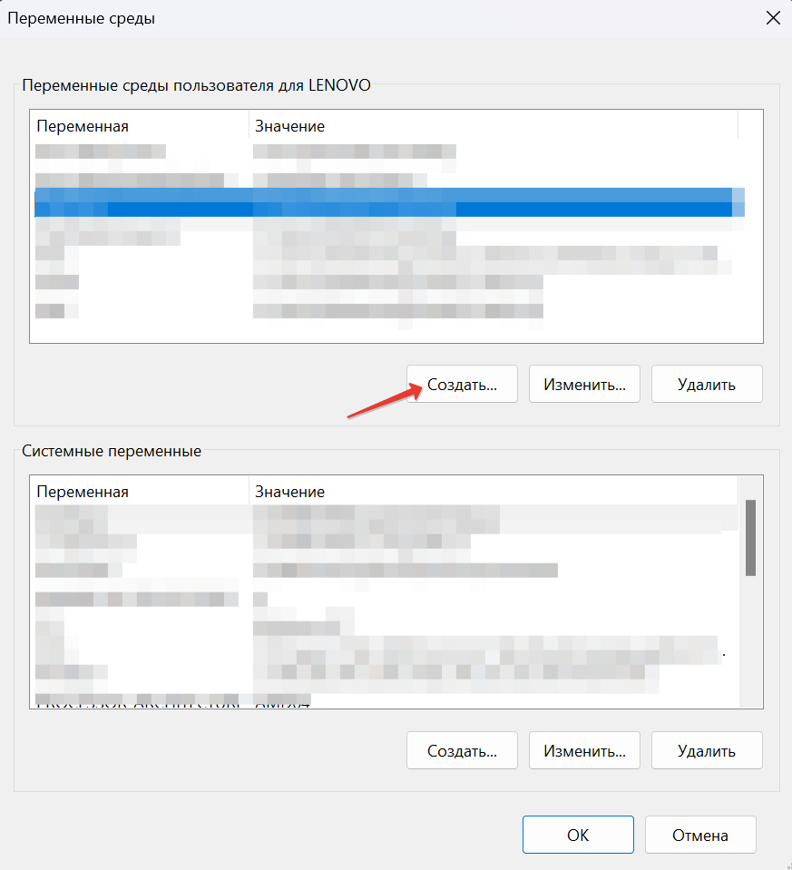

# Configuring Python for course development

**Content:**

* [Providing `PYTHONPATH` on Windows](#pythonpath-windows)
* [Setting up a `virtualenv`](#setting-virtualenv)
* [Spell checking](#spell-checking)

## <a name="pythonpath-windows"></a>Providing `PYTHONPATH` on Windows

To set `PYTHONPATH` on a windows machine follow the below steps:

1. Open the Windows search bar and type `python.exe` (do not press Enter).
Then right-click on the `python.exe` that appears in the menu and select **Open file location**.
2. Copy all path to `python.exe`.
3. Then right-click **This PC** and select **Properties**. Сlick on the
**Advanced system settings** option. In the next window, select the
**Advanced** tab and select **Environment Variables**.

   

4. In the **User Variables** menu, find a variable named **Path**.
Then paste the path you copied earlier into the **Variable Value** option.
   1. If you cannot find variable **Path**, create one. To do this, click **New**.
      Then in the variable name form type `PYTHONPATH` and paste your Python path into
      the variable value field.

      

5. Go back to the `python.exe` folder and open the **Scripts** folder. Copy its path.
6. Go back to **Environment variables**. Type a semicolon after the path to `python.exe` and
paste the path to the **Scripts** folder. Click OK.

   

To see if Python is added to the Windows PATH, open a terminal and type `python --version`,
then press Enter. If it returns the currently installed version of Python, then you have
successfully added it to the Windows PATH.

## <a name="setting-virtualenv"></a>Setting up a `virtualenv`

Instructions for macOS users:

```py
python3 -m pip install --user virtualenv
python3 -m virtualenv -p `which python3` venv
source venv/bin/activate
python -m pip install -r requirements.txt
```

Instructions for Windows users:

```py
python -m venv venv
venv\Scripts\activate
python -m pip install -r requirements.txt
```

## <a name="spell-checking"></a>Spell checking

1. Install dependencies
   [spell checker](https://facelessuser.github.io/pyspelling/#usage-in-linux).
   For example, for macOS:

   ```bash
   brew install aspell
   ```

2. Install Python dependencies:

   ```bash
   python -m pip install -r requirements_qa.txt
   ```

3. Run checks:

   ```bash
   python -m pyspelling -c config/spellcheck/.spellcheck.yaml
   ```
