# Starting guide

Before starting the “Computer Tools for Linguistic Research” course, each student needs to take a few steps 
that will prepare the necessary tools for further work:
1. [Check you have everything you need](#check-everything)
2. [Fork the repository](#creating-fork)
3. [Add mentors to collaborators](#adding-collaborators)
4. [Clone a fork of the repository to work locally](#cloning-fork)
5. [Create a project in PyCharm development environment](#creating-project-in-pycharm)
6. [Modify source code and push changes to remote fork](#working-pipeline)
7. [Create a Pull Request](#creating-pull-request)
8. [Continue working](#continue-working)

### Additionally

[Open a terminal](#open-terminal)

## Check you have everything you need

We assume that after completing the **“Programming for Linguists”** course, you have:
* Python interpreter
* Git version control system
* PyCharm development environment
* GitHub account

If you do not have any of these, go back to steps 1-5 from [the last course document](https://github.com/vitazaytseva/2022-2-level-ctlr.git).

## Fork the repository

To fork a repository on the Github, follow these steps:
1. Open the repository site that your lecturer has sent you

2. In the upper right corner click `Fork`

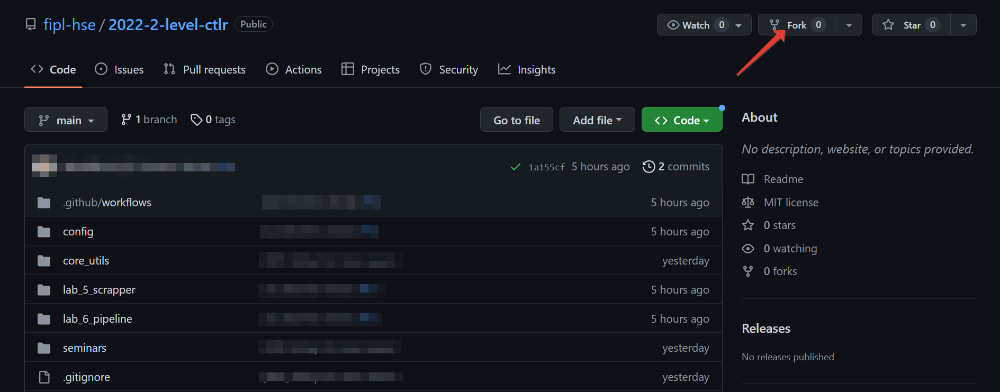

3. Click `Create Fork`

You have forked a repository! Pay attention to the link in the address bar of the browser: 
it should contain your Github username and the name of the repository: `https://github.com/<your-username>/202X-2-level-ctlr`

## Add mentors to collaborators

Only you can make changes to your fork. However, during the course, mentors will need to make changes to your fork: 
add changes from the main fork, resolve conflicts, etc. You should add mentors to **collaborators**, 
so they have such an opportunity.

To do this, follow these steps:
1. Open the fork site you created in the [Fork the repository](#creating-fork) step 

    * **NB**: Pay attention to the link in the address bar of the browser: 
    it should contain your Github username and the name of the repository.

2. Click `Settings`

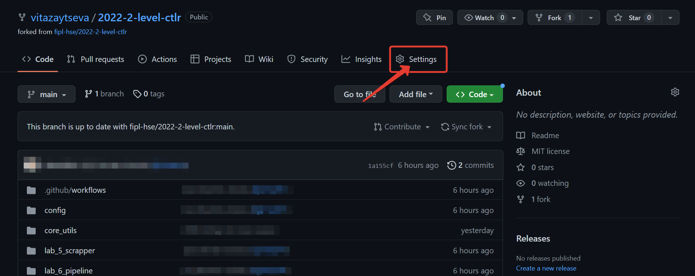

3. Select `Collaborators` from the left menu

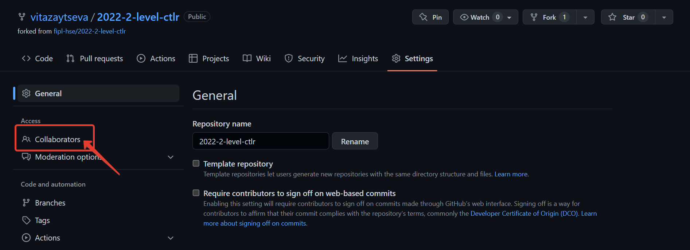

4. Click `Add people`

5. Enter mentor’s GitHub username, select it from the list, and click `Add <mentor’s-username> to this repository`

    * **NB**: You need to add [Dmitry Uraev](https://github.com/dmitry-uraev) 
    and [Marina Kazyulina](https://github.com/marina-kaz) to the collaborators.
   
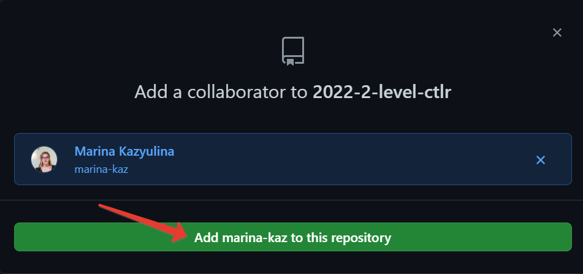

You have sent a mentor a request to be added to the collaborators! 
Write to the mentor so he/she can accept your request.

## Clone a fork of the repository to work locally

To clone a fork to work locally, follow these steps:
1. Open your fork's website

2. Click `Code`, select `HTTPS` and click the copy button

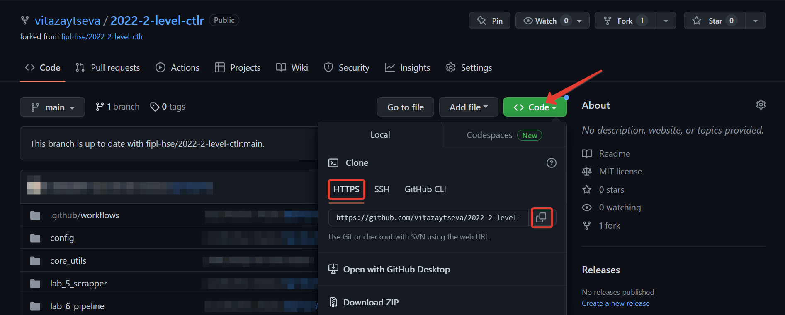

3. Open a terminal and navigate to a convenient folder

    * To move from folder to folder in the terminal, use the command `cd <folder-name>`
    * If you do not know how to open a terminal, go to [this section](#open-terminal).

4. Run `git clone <link-to-your-fork>` to clone the repository. 
For example, `git clone https://github.com/vitazaytseva/2022-2-level-ctlr.git`

    * **NB**: If asked for a password, enter your **Personal Access Token**.

## Create a project in PyCharm development environment

To create a project in the PyCharm development environment to work with your fork, follow these steps:
1. Open PyCharm and click `Open`

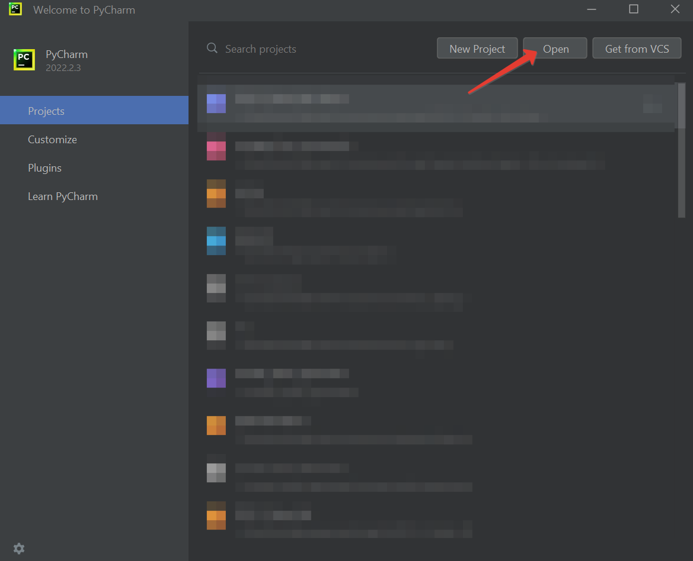

2. Select the folder with the fork that you cloned in the [Clone a fork of the repository to work locally](#cloning-fork) step and click `Open`

    * **NB**: You need to select the folder with the fork called `202X-2-level-ctlr`, not the folder with a specific lab.

3. Click `OK`

    * **NB**: If in the `Base Interpreter` field the Python version is < 3.9, then click `Python 3.X` and select a newer version from the drop-down list.

You have created a project!

## Modify source code and push changes to remote fork

You will work on different files in each lab folder. The process looks like this:
1. You change the source code in the file.
2. You commit changes using the `git` version control system.
3. You push changes to a remote fork.

### Change the source code

By default, functions do not have implementations - only `pass` in the function body. 
Your task is to implement functions according to the provided lab description.

### Commit changes

**Git** is a version control system that allows developers to save and track changes to project files at once.

To commit the changes, follow these steps:
1. Open a terminal in the PyCharm development environment.

2. Run `git add <path-to-file-with-changes>`. For example, `git add lab_5_scrapper/scrapper.py`

3. Run `git commit -m "message"`

    * **NB**: It is recommended to use a brief description of the changes you made as `message`. This text will be public.

### Push changes to remote fork

After the previous step the changes are in a committed state. They are stored only in your system. To send them to a remote fork, follow these steps:
1. Open a terminal in the PyCharm development environment.

2. Run `git pull`

    * **NB**: If asked for a password, enter your **Personal Access Token**.

3. Run `git push`

    * **NB**: If asked for a password, enter your **Personal Access Token**.

4. Open the main page of your remote fork

    * **NB**: You will see the *commit* and the *message* you wrote.

More information about the commands described above can be found in [the official Git documentation](https://git-scm.com/docs).

## Create a Pull Request

You need to create a Pull Request on GitHub, so mentors can review your changes and validate. To do this, follow these steps:
1. Open the repository site that your lecturer sent you.

2. Select Pull Requests

3. Click `New pull request`

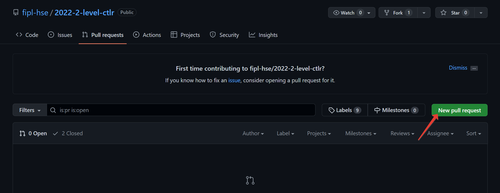

4. Click `compare across forks`

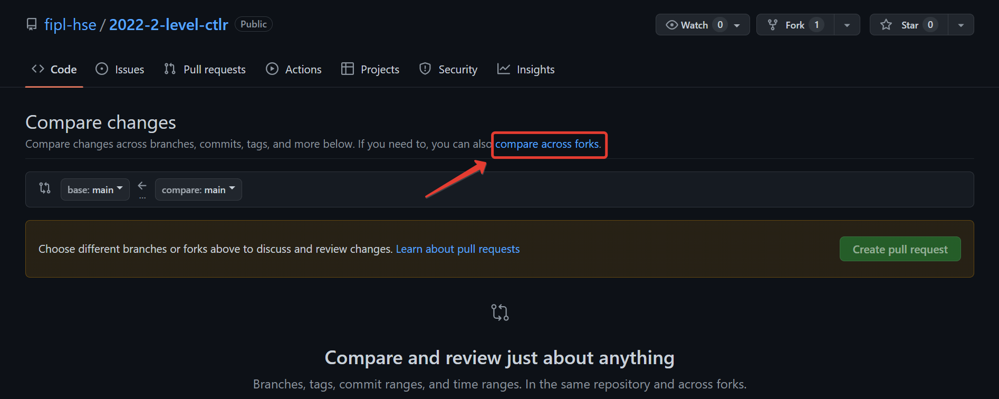

5. Click `head repository` and select your fork from the list (it contains your GitHub username).

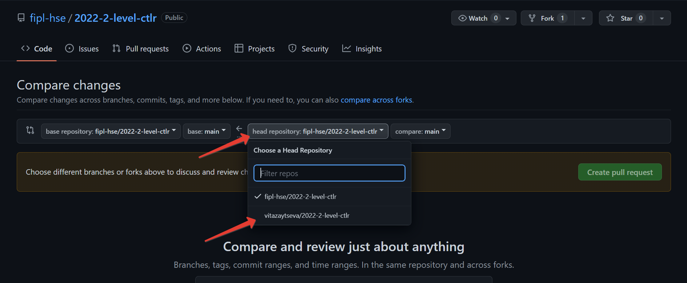

6. Click `Create pull request`

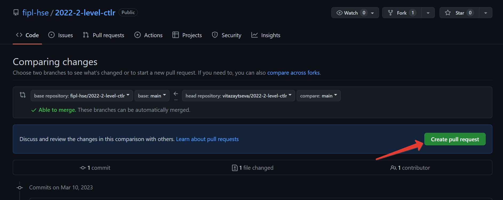

7. Enter a name for the Pull Request

    * **NB**: The Pull Request name for **Lab 5** must match the pattern: `Scrapper, Name Surname - 2XFPLX`
    * **NB**: The Pull Request name for **Lab 6** must match the pattern: `Pipeline, Name Surname - 2XFPLX`

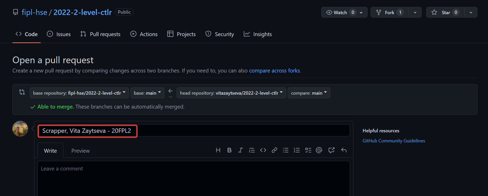

8. Click `Assignees` and select your mentor from the list.

    * **NB**: You can find your mentor in the progress sheet.

9. Click `Create pull request`

    * **NB**: Your Pull Request will appear in the Pull Requests.

## Continue working

Your work consists in repeating the following steps:
1. [You change the source code](#changing-code).
2. [You commit the changes](#committing-changes).
3. [You push changes to a remote fork](#pushing-changes). 

   * They will automatically be updated in the Pull Request you created.
   
5. The mentor reviews your code and leaves comments.
6. You correct the source code according to the comments.
7. See step #2

## Open a terminal

* [Instruction for Windows](https://docs.microsoft.com/ru-ru/powershell/scripting/windows-powershell/starting-windows-powershell?view=powershell-7.2)
* [Instruction for macOS](https://support.apple.com/ru-ru/guide/terminal/apd5265185d-f365-44cb-8b09-71a064a42125/mac)
