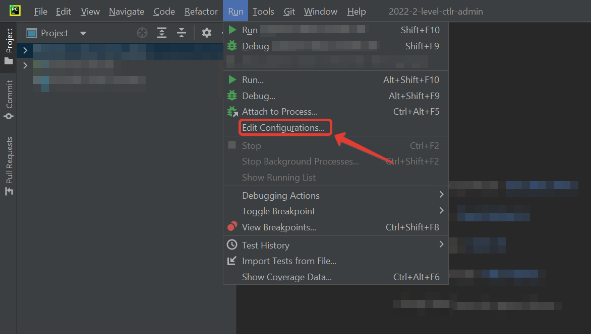
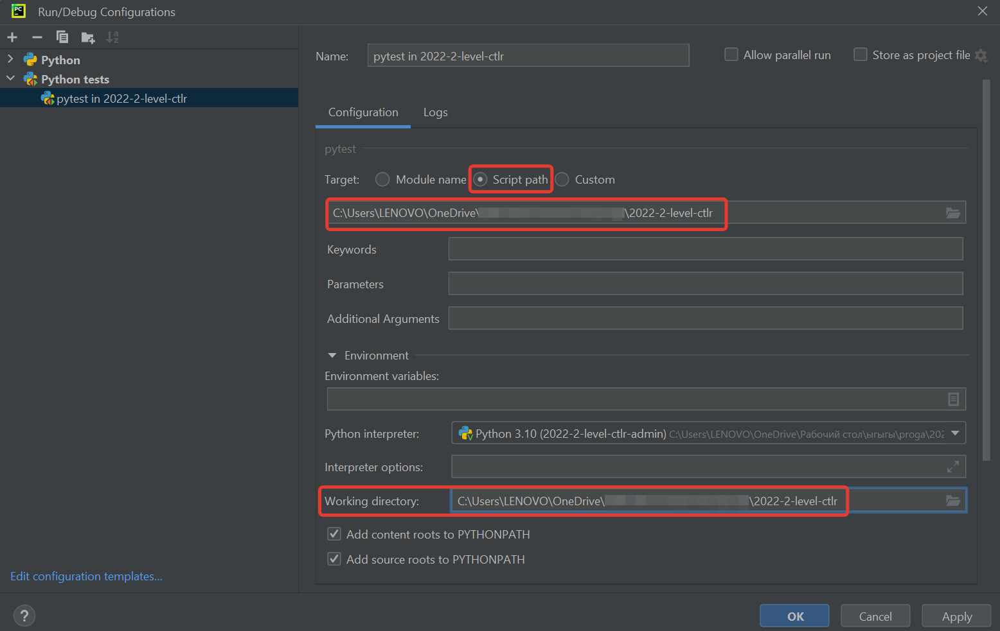
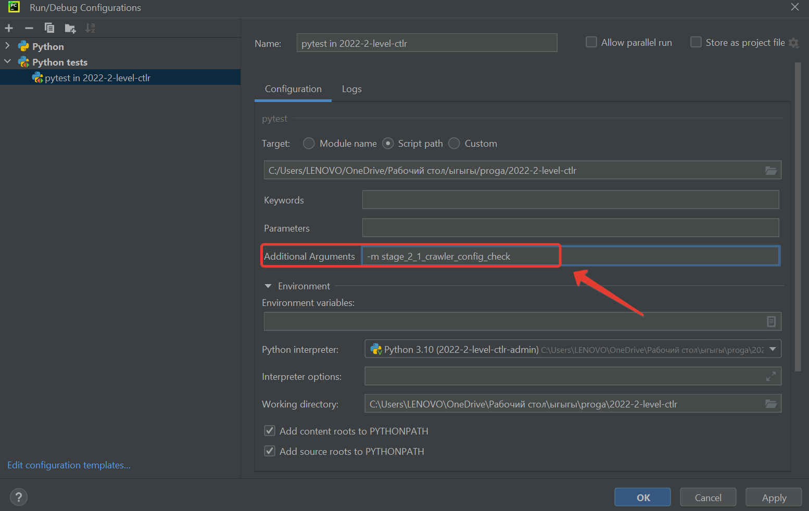
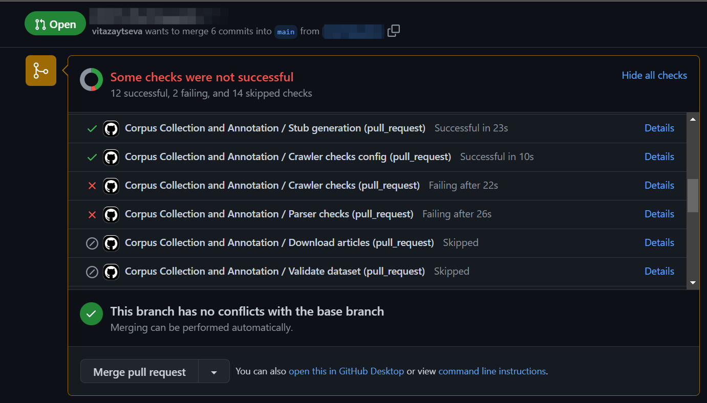

# Working with tests: locally and in CI

## Running tests locally

Before pushing your changes to a remote fork, you will want to check that your code is working correctly. 
To do this, you can run tests locally.

> **HINT:** If you extract articles URLs from dynamic site, 
> make sure you use `selenium.webdriver.Chrome` and have `headless mode` enabled.

To run tests locally, you need to perform several steps in PyCharm:

1. Install tests dependencies (ensure you have activated your environment if you have such by running
   `.\venv\Scripts\activate`):
   ```bash
   python -m pip install -r requirements_qa.txt
   ```

2. Create a new configuration:


   

3. Choose `pytest` as a target:


   

4. Fill `pytest` configuration and click `OK`:


   

5. Run `pytest` configuration:


   
   
   This should run all the tests in the repository. You can inspect them by clicking through a list
   at the bottom of a screen.

   

6. As you have some tests failing, you want to debug them. Then, first, you need to limit
   a scope of running tests and the mark level you want to get for an assignment. For example,
   you might want to run checks for a crawler configuration. Then you need to return 
   to configuration menu and pass additional parameters, like `-m stage_2_1_crawler_config_check`.
   

   
   
   You can choose any of the labels that are described in [`../pyproject.toml`](../../pyproject.toml)
   and combine with a mark. For example, running the aforementioned check for configuration for a
   mark 8 will look like `-m "mark8 and stage_2_1_crawler_config_check"`. 

> **HINT:** To running all tests for first assignment for mark 8: 
> `-m "mark8 and (stage_2_1_crawler_config_check or stage_2_2_crawler_check or stage_2_3_HTML_parser_check or stage_2_4_dataset_volume_check or stage_2_5_dataset_validation)"`

> **HINT:** When you want to debug a test, instead of running them, put a breakpoint at the potentially vulnerable
> place of code and execute debugging by clicking a 'bug' button.


## Running tests in CI

Tests will never run until you create a Pull Request.   

The very first check happens 
exactly when you create a Pull Request. After that, each time you push changes in your fork,
CI check will be automatically started, normally within a minute or two. To see the results,
navigate to your PR and click either the particular step in the report at the end of a page,
or click **Checks** in the toolbar. 




Inspect each step by clicking through the list to the left.


## Frequently asked questions

### Question 1. Why is my CI job cancelled?

**Answer**: usually that happens because your CI check runs for too long. Possible reasons is that you
do not control number of articles that you collect from your seed URL. If you feel that 
the problem is with infrastructure, call a mentor in the group chat.

### Question 2. Why is my CI job not started?

**Answer**: usually that happens because your fork has conflicts with a base repository. Resolve them
by merging the upstream, or if it all sounds new for you,  call a mentor in the group chat.
